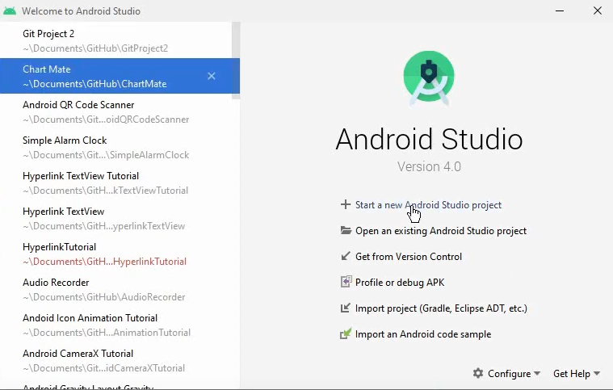

### Project Title


TikTakNews - An app built for its users to browse US news articles, search relevant articles, and curate their personalised favourite articles to return to.

### Prerequisites
What is needed to set up the dev environment. For instance, global dependencies or any other tools. include download links.

1. Download and install Android Studio
   https://developer.android.com/studio/intro
2. If you encounter a JAVA related error, make sure you have Java 11 installed and JAVA_HOME is set to the JDK’s folder
   https://www3.ntu.edu.sg/home/ehchua/programming/howto/Environment_Variables.html
3. Prepare one Android device for testing
   Create one Android Emulator on Android Studio: https://developer.android.com/studio/run/emulator
   You can use real Android device as well: https://developer.android.com/studio/debug/dev-options
4. Try to create and run one Android application to make sure everything is working fine
   https://developer.android.com/studio/projects/templates
   Feel free to use any existing templates provided by Android Studio
5. You are ready!


## Installing / Getting started

Here are the instructions for how to get a copy of the project running on your local machine.

To clone this git repository, you can either do 1 or 2:
1. Open Android Studio, and open the Terminal

```shell
git clone https://github.com/ArQcane/TikTakNews.git
```
OR 

2. Alternatively,
Start a new Android Studio Project,

Select File > New > Project from Version Control
Enter the Github URL: https://github.com/ArQcane/TikTakNews.git
and Clone

### Built With (Dependencies)
List main libraries, frameworks used including versions (React, Angular etc...)
[Maven Library](https://mvnrepository.com/), Kotlin, MVVM, JUnit4, and Google Firebase Authentication 

### Installation

Simply proceed to ./app/release to find the .apk file and install it.

## Api Reference

For this project, we used the following API:

https://newsapi.org/

## Contributors

* [Isaac](https://github.com/ArQcane)
* [Dorian](https://github.com/dorianfong98)
* [Kenneth](https://github.com/Scrunchy711)
* [Sherise](http://github.com/sherise911)

